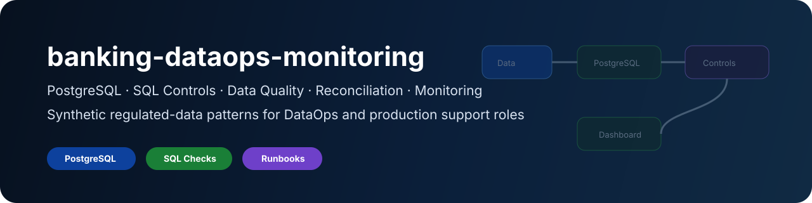
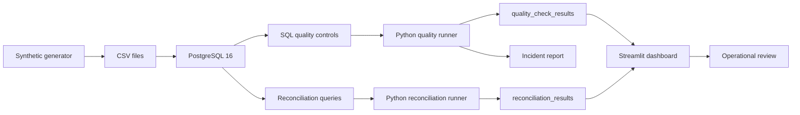

# banking-dataops-monitoring

<div align="center">



<br/>

**Synthetic regulated-data monitoring lab for DataOps, data quality, reconciliation and production support**

PostgreSQL / Python / SQL controls / Streamlit / Data quality / Reconciliation / Incident runbooks


[](https://github.com/KinSushi/banking-dataops-monitoring/actions)


</div>

---

## Executive summary

`banking-dataops-monitoring` is a public technical portfolio repository demonstrating a complete local DataOps control loop using synthetic regulated-data patterns.

```text
synthetic data -> PostgreSQL -> SQL controls -> Python runner -> reconciliation -> Streamlit dashboard -> incident report
```

It is designed to prove SQL, Python, data quality, data reconciliation, monitoring, incident investigation and regulated-data production support readiness.

No real banking, insurance, health, client, employer or private data belongs here.

---

## Validation evidence

Generated validation artifacts are available in:

- [docs/local_run_report.md](docs/local_run_report.md)
- [docs/screenshots.md](docs/screenshots.md)
- [docs/VALIDATION.md](docs/VALIDATION.md)

Current public validation covers:

```text
pip install
python -m compileall
pytest
ruff
synthetic data generation
package import checks
secret keyword review
```

The latest report shows `pytest`, `ruff`, synthetic data generation and import checks passing. The `secret-keyword-scan` step is intentionally marked as `REVIEW` because documentation and `.env.example` contain safety-related keywords.

---

## Documentation index

| Document | Purpose |
|---|---|
| [PORTFOLIO.md](PORTFOLIO.md) | Recruiter-readable technical brief |
| [docs/architecture.md](docs/architecture.md) | System architecture and execution flow |
| [docs/data_dictionary.md](docs/data_dictionary.md) | Table and field definitions |
| [docs/controls_matrix.md](docs/controls_matrix.md) | Data controls mapped to risks and evidence |
| [docs/incident_runbook.md](docs/incident_runbook.md) | Incident investigation workflow |
| [docs/rollback_plan.md](docs/rollback_plan.md) | Local reset and rollback procedure |
| [docs/monitoring_plan.md](docs/monitoring_plan.md) | Monitoring dimensions and future observability path |
| [docs/public_safety.md](docs/public_safety.md) | Public GitHub safety rules |
| [docs/screenshots.md](docs/screenshots.md) | Validation previews and content screenshots |
| [docs/VALIDATION.md](docs/VALIDATION.md) | Local and CI validation procedure |

---

## What a run produces (synthetic data)

A full local run executes the control loop end to end and leaves reproducible evidence on disk:

| Stage | Output |
|---|---|
| Quality controls | 7 checks (nulls, duplicates, invalid amounts, referential integrity, risk score, status, freshness) |
| Reconciliation | source-vs-target row and amount deltas in `reports/` |
| Dashboard | Streamlit monitoring view (`dashboard/streamlit_app.py`) |
| Incident | runbook-driven investigation note in `docs/incident_runbook.md` |
| Validation | `pytest` + `ruff` results in `docs/local_run_report.md` |

Reproduce with `make reset` then `make ci`. All figures come from **synthetic** data only.

---

## Target roles

| Role family | Why this project helps |
|---|---|
| Data Engineer | schema, ingestion, SQL and Python data flow |
| DataOps Engineer | quality checks, monitoring, reconciliation, runbooks |
| Application & Data Support | incident investigation and operational controls |
| IT Production Engineer | runtime, Docker, Makefile, operational commands |
| Data Quality Analyst | controls matrix and validation evidence |
| Risk / Compliance Data Analyst | anomaly monitoring and audit-oriented documentation |
| Insurance / Claims Data Analyst | claims-style data-quality and reconciliation patterns |
| Big-tech data platforms | reproducibility, CI, tests and monitoring pattern |

---

## Architecture



---

## Quickstart

```bash
make install
make generate
make ci
make up
make ingest
make quality
make reconcile
make incident
make dashboard
```

One-command local reset:

```bash
make reset
```

---

## Repository structure

```text
banking-dataops-monitoring/
|-- README.md
|-- PORTFOLIO.md
|-- LICENSE
|-- .env.example
|-- pyproject.toml
|-- Makefile
|-- docker-compose.yml
|-- assets/
|-- .github/workflows/
|-- data/
|-- sql/
|-- src/banking_dataops/
|-- dashboard/
|-- tests/
`-- docs/
```

---

## Quality controls

| Control | Evidence |
|---|---|
| Critical nulls | `src/banking_dataops/quality_checks.py`, `sql/02_data_quality_checks.sql` |
| Duplicate transactions | `src/banking_dataops/quality_checks.py`, `sql/02_data_quality_checks.sql` |
| Invalid amounts | `src/banking_dataops/quality_checks.py`, `sql/02_data_quality_checks.sql` |
| Referential integrity | `src/banking_dataops/quality_checks.py`, `sql/02_data_quality_checks.sql` |
| Invalid risk score | `src/banking_dataops/quality_checks.py`, `sql/02_data_quality_checks.sql` |
| Invalid status | `src/banking_dataops/quality_checks.py`, `sql/02_data_quality_checks.sql` |
| Freshness | `src/banking_dataops/quality_checks.py`, `sql/02_data_quality_checks.sql` |
| Source-system reconciliation | `src/banking_dataops/reconciliation.py`, `sql/03_reconciliation_queries.sql` |
| Dashboard monitoring | `dashboard/streamlit_app.py` |
| Incident workflow | `docs/incident_runbook.md` |

---

## Tests and CI

```bash
make ci
```

The standard CI workflow runs:

```text
ruff check .
pytest
```

The extended portfolio validation workflow also generates public validation reports and screenshots under `docs/`.

---

## Public-safety rules

- synthetic data only;
- no real bank data;
- no real insurance or health data;
- no real client data;
- no employer-specific application content;
- no CVs, cover letters or job trackers;
- no salary targets;
- no secrets, tokens, hostnames or private IPs;
- no production decisioning claims.

---

## Non-goals

This project is not:

- a production data platform;
- a bank-grade control framework;
- a real fraud system;
- an investment, credit, insurance or health decision engine;
- a repository for job applications.

---

## Portfolio signal

This repository proves the ability to build, document and operate a small but complete regulated-data monitoring loop: generation, ingestion, validation, reconciliation, reporting, incident handling and public safety boundaries.

---

## Portfolio layer

This repository is part of the KinSushi public technical portfolio.

| Layer | Evidence |
|---|---|
| DataOps | SQL controls, reconciliation, Streamlit monitoring, incident runbooks |

Detailed cross-repository context: [docs/PORTFOLIO_LAYER.md](docs/PORTFOLIO_LAYER.md)
# banking-dataops-monitoring

<div align="center">


<br/>

**Synthetic regulated-data monitoring lab for DataOps, data quality, reconciliation and production support**

PostgreSQL / Python / SQL controls / Streamlit / Data quality / Reconciliation / Incident runbooks


[](https://github.com/KinSushi/banking-dataops-monitoring/actions)


</div>

---

## Executive summary

`banking-dataops-monitoring` is a public technical portfolio repository demonstrating a complete local DataOps control loop using synthetic regulated-data patterns.

```text
synthetic data -> PostgreSQL -> SQL controls -> Python runner -> reconciliation -> Streamlit dashboard -> incident report
```

It is designed to prove SQL, Python, data quality, data reconciliation, monitoring, incident investigation and regulated-data production support readiness.

No real banking, insurance, health, client, employer or private data belongs here.

---

## Validation evidence

Generated validation artifacts are available in:

- [docs/local_run_report.md](docs/local_run_report.md)
- [docs/screenshots.md](docs/screenshots.md)
- [docs/VALIDATION.md](docs/VALIDATION.md)

Current public validation covers:

```text
pip install
python -m compileall
pytest
ruff
synthetic data generation
package import checks
secret keyword review
```

The latest report shows `pytest`, `ruff`, synthetic data generation and import checks passing. The `secret-keyword-scan` step is intentionally marked as `REVIEW` because documentation and `.env.example` contain safety-related keywords.

---

## Documentation index

| Document | Purpose |
|---|---|
| [PORTFOLIO.md](PORTFOLIO.md) | Recruiter-readable technical brief |
| [docs/architecture.md](docs/architecture.md) | System architecture and execution flow |
| [docs/data_dictionary.md](docs/data_dictionary.md) | Table and field definitions |
| [docs/controls_matrix.md](docs/controls_matrix.md) | Data controls mapped to risks and evidence |
| [docs/incident_runbook.md](docs/incident_runbook.md) | Incident investigation workflow |
| [docs/rollback_plan.md](docs/rollback_plan.md) | Local reset and rollback procedure |
| [docs/monitoring_plan.md](docs/monitoring_plan.md) | Monitoring dimensions and future observability path |
| [docs/public_safety.md](docs/public_safety.md) | Public GitHub safety rules |
| [docs/screenshots.md](docs/screenshots.md) | Validation previews and content screenshots |
| [docs/VALIDATION.md](docs/VALIDATION.md) | Local and CI validation procedure |

---

## What a run produces (synthetic data)

A full local run executes the control loop end to end and leaves reproducible evidence on disk:

| Stage | Output |
|---|---|
| Quality controls | 7 checks (nulls, duplicates, invalid amounts, referential integrity, risk score, status, freshness) |
| Reconciliation | source-vs-target row and amount deltas in `reports/` |
| Dashboard | Streamlit monitoring view (`dashboard/streamlit_app.py`) |
| Incident | runbook-driven investigation note in `docs/incident_runbook.md` |
| Validation | `pytest` + `ruff` results in `docs/local_run_report.md` |

Reproduce with `make reset` then `make ci`. All figures come from **synthetic** data only.

---

## Target roles

| Role family | Why this project helps |
|---|---|
| Junior Data Engineer | schema, ingestion, SQL and Python data flow |
| DataOps Engineer | quality checks, monitoring, reconciliation, runbooks |
| Application & Data Support | incident investigation and operational controls |
| IT Production Engineer | runtime, Docker, Makefile, operational commands |
| Data Quality Analyst | controls matrix and validation evidence |
| Risk / Compliance Data Analyst | anomaly monitoring and audit-oriented documentation |
| Insurance / Claims Data Analyst | claims-style data-quality and reconciliation patterns |
| Big-tech data platforms | reproducibility, CI, tests and monitoring pattern |

---

## Architecture


---

## Quickstart

```bash
make install
make generate
make ci
make up
make ingest
make quality
make reconcile
make incident
make dashboard
```

One-command local reset:

```bash
make reset
```

---

## Repository structure

```text
banking-dataops-monitoring/
|-- README.md
|-- PORTFOLIO.md
|-- LICENSE
|-- .env.example
|-- pyproject.toml
|-- Makefile
|-- docker-compose.yml
|-- assets/
|-- .github/workflows/
|-- data/
|-- sql/
|-- src/banking_dataops/
|-- dashboard/
|-- tests/
`-- docs/
```

---

## Quality controls

| Control | Evidence |
|---|---|
| Critical nulls | `src/banking_dataops/quality_checks.py`, `sql/02_data_quality_checks.sql` |
| Duplicate transactions | `src/banking_dataops/quality_checks.py`, `sql/02_data_quality_checks.sql` |
| Invalid amounts | `src/banking_dataops/quality_checks.py`, `sql/02_data_quality_checks.sql` |
| Referential integrity | `src/banking_dataops/quality_checks.py`, `sql/02_data_quality_checks.sql` |
| Invalid risk score | `src/banking_dataops/quality_checks.py`, `sql/02_data_quality_checks.sql` |
| Invalid status | `src/banking_dataops/quality_checks.py`, `sql/02_data_quality_checks.sql` |
| Freshness | `src/banking_dataops/quality_checks.py`, `sql/02_data_quality_checks.sql` |
| Source-system reconciliation | `src/banking_dataops/reconciliation.py`, `sql/03_reconciliation_queries.sql` |
| Dashboard monitoring | `dashboard/streamlit_app.py` |
| Incident workflow | `docs/incident_runbook.md` |

---

## Tests and CI

```bash
make ci
```

The standard CI workflow runs:

```text
ruff check .
pytest
```

The extended portfolio validation workflow also generates public validation reports and screenshots under `docs/`.

---

## Public-safety rules

- synthetic data only;
- no real bank data;
- no real insurance or health data;
- no real client data;
- no employer-specific application content;
- no CVs, cover letters or job trackers;
- no salary targets;
- no secrets, tokens, hostnames or private IPs;
- no production decisioning claims.

---

## Non-goals

This project is not:

- a production data platform;
- a bank-grade control framework;
- a real fraud system;
- an investment, credit, insurance or health decision engine;
- a repository for job applications.

---

## Portfolio signal

This repository proves the ability to build, document and operate a small but complete regulated-data monitoring loop: generation, ingestion, validation, reconciliation, reporting, incident handling and public safety boundaries.

---

## Portfolio layer

This repository is part of the KinSushi public technical portfolio.

| Layer | Evidence |
|---|---|
| DataOps | SQL controls, reconciliation, Streamlit monitoring, incident runbooks |

Detailed cross-repository context: [docs/PORTFOLIO_LAYER.md](docs/PORTFOLIO_LAYER.md)
