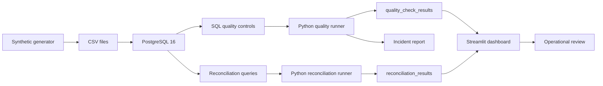

# banking-dataops-monitoring

<div align="center">


<br/>

**Synthetic regulated-data monitoring lab for DataOps, data quality, reconciliation and production support**

PostgreSQL · Python · SQL controls · Streamlit · Data quality · Reconciliation · Incident runbooks


</div>

---

## Executive summary

`banking-dataops-monitoring` is a public technical portfolio repository demonstrating a complete local DataOps control loop using synthetic regulated-data patterns.

```text
synthetic data -> PostgreSQL -> SQL controls -> Python runner -> reconciliation -> Streamlit dashboard -> incident report
```

It is designed to prove SQL, Python, data quality, data reconciliation, monitoring, incident investigation and regulated-data production support readiness.

No real banking, insurance, health, client, employer or private data belongs here.

---

## Documentation index

| Document | Purpose |
|---|---|
| [PORTFOLIO.md](PORTFOLIO.md) | Recruiter-readable technical brief |
| [docs/architecture.md](docs/architecture.md) | System architecture and execution flow |
| [docs/data_dictionary.md](docs/data_dictionary.md) | Table and field definitions |
| [docs/controls_matrix.md](docs/controls_matrix.md) | Data controls mapped to risks and evidence |
| [docs/incident_runbook.md](docs/incident_runbook.md) | Incident investigation workflow |
| [docs/rollback_plan.md](docs/rollback_plan.md) | Local reset and rollback procedure |
| [docs/monitoring_plan.md](docs/monitoring_plan.md) | Monitoring dimensions and future observability path |
| [docs/public_safety.md](docs/public_safety.md) | Public GitHub safety rules |
| [docs/screenshots.md](docs/screenshots.md) | Screenshot placeholders to fill after local execution |

---

## Target roles

| Role family | Why this project helps |
|---|---|
| Junior Data Engineer | schema, ingestion, SQL and Python data flow |
| DataOps Engineer | quality checks, monitoring, reconciliation, runbooks |
| Application & Data Support | incident investigation and operational controls |
| IT Production Engineer | runtime, Docker, Makefile, operational commands |
| Data Quality Analyst | controls matrix and validation evidence |
| Risk / Compliance Data Analyst | anomaly monitoring and audit-oriented documentation |
| Insurance / Claims Data Analyst | claims-style data-quality and reconciliation patterns |
| Big-tech data platforms | reproducibility, CI, tests and monitoring pattern |

---

## Architecture



---

## Quickstart

```bash
# install dependencies
make install

# generate synthetic CSV data
make generate

# run unit tests and lint checks
make ci

# start PostgreSQL
make up

# load CSV files into PostgreSQL
make ingest

# run SQL-backed quality controls
make quality

# run reconciliation summaries
make reconcile

# generate incident report if controls failed
make incident

# launch dashboard
make dashboard
```

One-command local reset:

```bash
make reset
```

---

## Repository structure

```text
banking-dataops-monitoring/
├── README.md
├── PORTFOLIO.md
├── LICENSE
├── .gitignore
├── .env.example
├── pyproject.toml
├── Makefile
├── docker-compose.yml
├── assets/
│   └── banking-dataops-banner.svg
├── .github/
│   └── workflows/
│       └── ci.yml
├── data/
│   ├── .gitkeep
│   └── README.md
├── sql/
│   ├── 00_schema.sql
│   ├── 01_seed_reference_data.sql
│   ├── 02_data_quality_checks.sql
│   ├── 03_reconciliation_queries.sql
│   ├── 04_anomaly_queries.sql
│   └── 05_performance_queries.sql
├── src/
│   └── banking_dataops/
│       ├── __init__.py
│       ├── config.py
│       ├── db.py
│       ├── generate_synthetic_data.py
│       ├── ingest.py
│       ├── quality_checks.py
│       ├── reconciliation.py
│       ├── monitoring.py
│       └── incident_report.py
├── dashboard/
│   └── streamlit_app.py
├── tests/
└── docs/
```

---

## Quality controls

| Control | Evidence |
|---|---|
| Critical nulls | `src/banking_dataops/quality_checks.py`, `sql/02_data_quality_checks.sql` |
| Duplicate transactions | `src/banking_dataops/quality_checks.py`, `sql/02_data_quality_checks.sql` |
| Invalid amounts | `src/banking_dataops/quality_checks.py`, `sql/02_data_quality_checks.sql` |
| Referential integrity | `src/banking_dataops/quality_checks.py`, `sql/02_data_quality_checks.sql` |
| Invalid risk score | `src/banking_dataops/quality_checks.py`, `sql/02_data_quality_checks.sql` |
| Invalid status | `src/banking_dataops/quality_checks.py`, `sql/02_data_quality_checks.sql` |
| Freshness | `src/banking_dataops/quality_checks.py`, `sql/02_data_quality_checks.sql` |
| Source-system reconciliation | `src/banking_dataops/reconciliation.py`, `sql/03_reconciliation_queries.sql` |
| Dashboard monitoring | `dashboard/streamlit_app.py` |
| Incident workflow | `docs/incident_runbook.md` |

---

## Tests and CI

```bash
make ci
```

The GitHub Actions workflow runs:

```text
ruff check .
pytest
```

The CI does not require PostgreSQL for V1. Database-backed flows are run locally with Docker.

---

## Public-safety rules

- synthetic data only;
- no real bank data;
- no real insurance or health data;
- no real client data;
- no employer-specific application content;
- no CVs, cover letters or job trackers;
- no salary targets;
- no secrets, tokens, hostnames or private IPs;
- no production decisioning claims.

---

## Non-goals

This project is not:

- a production data platform;
- a bank-grade control framework;
- a real fraud system;
- an investment, credit, insurance or health decision engine;
- a repository for job applications.

---

## Portfolio signal

This repository proves that the author can build, document and operate a small but complete regulated-data monitoring loop: generation, ingestion, validation, reconciliation, reporting, incident handling and public safety boundaries.
---

## Portfolio layer

This repository is part of the KinSushi public technical portfolio.

| Layer | Evidence |
|---|---|
| DataOps | SQL controls, reconciliation, Streamlit monitoring, incident runbooks |

Detailed cross-repository context: [docs/PORTFOLIO_LAYER.md](docs/PORTFOLIO_LAYER.md)

