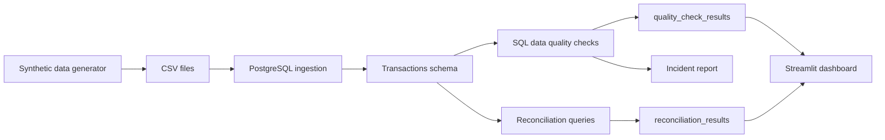

# Architecture — banking-dataops-monitoring

## Purpose

This document describes the executable architecture of the `banking-dataops-monitoring` project.

The project demonstrates a regulated-data monitoring pattern using synthetic data only.

---

## Architecture diagram

---

## Components

| Component | Path | Purpose |
|---|---|---|
| Synthetic data generator | `src/banking_dataops/generate_synthetic_data.py` | Creates fake customers, accounts and transactions |
| PostgreSQL schema | `sql/00_schema.sql` | Defines customers, accounts, transactions and result tables |
| Ingestion runner | `src/banking_dataops/ingest.py` | Loads generated CSV files into PostgreSQL |
| Quality runner | `src/banking_dataops/quality_checks.py` | Runs quality controls and persists results |
| Reconciliation runner | `src/banking_dataops/reconciliation.py` | Summarizes transaction counts and amounts |
| Dashboard | `dashboard/streamlit_app.py` | Displays quality status, volume and summaries |
| Controls matrix | `docs/controls_matrix.md` | Maps controls to risks and evidence |
| Incident runbook | `docs/incident_runbook.md` | Documents investigation and response workflow |

---

## Public-safety boundary

No real banking, insurance, health, client, employer or private data belongs in this project.
